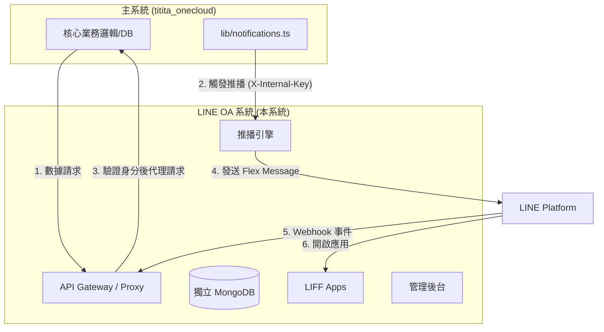

# LINE OA 整合系統 — 設計方案 (2026-05 更新)

> **目標**：作為音樂補習班管理系統的**周圍系統**，透過 LINE Messaging API 讓家長/教師用手機號碼綁定 LINE OA，接收課程通知、請假結果、學費提醒等推播訊息，並提供課表、點數查詢等 LIFF 應用。

---

## 1. 系統定位與架構

### 1.1 系統邊界與互動
本系統定位為「通訊代理層」，負責處理所有與 LINE 平台的對接邏輯，核心業務數據仍由主系統 `titita_onecloud` 管理。



---

## 2. 專案目錄結構 (2026-05 現況)

```
titita_lineoa/
├── app/
│   ├── admin/                         # 管理員 Web 後台
│   │   ├── login/                     #   └ 管理員登入 (LINE 登入/帳密)
│   │   ├── notify/                    #   └ 手動推播與廣播工具
│   │   ├── recipients/                #   └ 已綁定成員清單與管理
│   │   └── logs/                      #   └ 推播與綁定紀錄追蹤
│   ├── api/
│   │   ├── internal/                  # LIFF 專用代理 API (Proxy)
│   │   │   └── users/                 #   └ 課表、點數、請假代理 (驗證 id_token)
│   │   ├── line/                      # LINE 核心 API
│   │   │   ├── webhook/               #   └ Webhook 接收 (follow/message/postback)
│   │   │   ├── bind/                  #   └ 綁定邏輯 (含 Bind Token 驗證)
│   │   │   └── notify/                #   └ 主系統推播入口
│   │   └── admin/                     # 後台專用 API (統計、廣播、登入)
│   └── liff/                          # LIFF 前端頁面
│       ├── bind/                      #   └ 帳號綁定引導頁
│       ├── courses/                   #   └ 學生個人課表
│       └── points/                    #   └ 獎勵點數存摺
├── lib/
│   ├── line/
│   │   ├── templates.ts               # Jelly Kids 風格 Flex Message 模板
│   │   └── push.ts                    # 高可靠推播引擎 (含自動重試與錯誤追蹤)
│   ├── db/                            # MongoDB 連線與 Models
│   ├── bind-token.ts                  # 簽名令牌 (防止手機綁定劫持)
│   ├── verify-ownership.ts            # 所有權驗證 (防止 IDOR 攻擊)
│   ├── main-system-client.ts          # 主系統 Internal API 通訊封裝
│   └── rate-limit.ts                  # API 速率限制 (防護暴力破解)
└── ...
```

---

## 3. 核心設計原則

### 3.1 安全性 (Security First)
- **Bind Token 機制**：在綁定流程中使用加密簽名的 Token，確保綁定目標與手機查詢結果鎖定，防止中間人惡意串接他人帳號。
- **身分驗證代理 (Proxy)**：LIFF 不直接存取主系統，而是透過本系統驗證 LINE `id_token` 後，由後端以內部身份進行數據交換。
- **所有權驗證 (Ownership Verification)**：所有針對學生資料的 API 皆會驗證該 LINE 使用者確實與目標學生有綁定關係。

### 3.2 視覺設計 (Aesthetics)
- **Jelly Kids 風格**：推播訊息與 LIFF 統一採用高飽和度、圓角設計的「童趣果凍風」，提升補習班品牌質感。
- **專業化格式**：日期時間皆過格式化轉換（如：2026年5月3日），避免顯示原始數據格式。

### 3.3 可靠性 (Reliability)
- **推播日誌紀錄**：每一筆推播皆記錄 `status` 與 `error_message`，管理員可從後台診斷發送失敗的原因（如：用戶封鎖、無效 User ID）。
- **快取機制**：系統設定實作 5 秒短期快取，平衡實時性與資料庫負載。

---

## 4. 當前開發狀態 (2026-05)

### ✅ 已完成亮點
1. **安全性加固**：完成 Bind Token 與 API 所有權驗證機制。
2. **視覺優化**：全面更新為 Jelly Kids 設計語言，並修正專業日期格式。
3. **穩定運行**：已移除所有 Mock 資料，正式與 `titita_onecloud` 生產環境串接。
4. **管理功能**：實現即時綁定統計、收件人識別格式化（學生名+LINE名）、以及登入流程優化。

### 📅 下階段目標
1. **Rich Menu 多樣化**：根據使用者角色（家長/老師）動態切換不同的選單內容。
2. **自動化運維**：串接監控警報，當推播失敗率過高時自動通知工程師。
3. **離線通知緩衝**：處理當 LINE 伺服器繁忙時的排隊機制。

---
*本文件為動態更新，最新異動請參考 GitHub 提交紀錄。*
