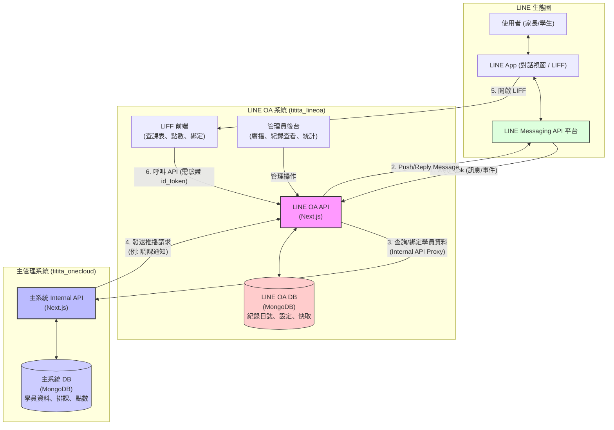

# LINE OA 整合系統 — 架構設計圖

本文件記錄 `titita_lineoa` (LINE 模組) 與 `titita_onecloud` (主管理系統) 之間的元件互動架構。

## 1. 系統交互總覽

## 2. 核心元件說明

### 2.1 LINE OA 系統 (titita_lineoa)
*   **職責**：作為橋樑，處理 LINE 平台的所有 Webhook、推送 Push Message、以及託管 LIFF 頁面。
*   **獨立資料庫**：擁有獨立的 MongoDB，用於儲存推播日誌 (`LineNotifyLog`)、綁定日誌 (`LineBindLog`) 與系統設定。
*   **管理後台**：提供管理員進行「全體/多選廣播」以及查看所有發送紀錄與統計。

### 2.2 主管理系統 (titita_onecloud)
*   **職責**：補習班的核心營運系統，包含學員、課程、點數、學費等真實數據。
*   **Internal API**：不對外公開，專供 `titita_lineoa` 進行數據交換。
*   **觸發通知**：在 `lib/notifications.ts` 中，當業務邏輯（如請假被核准）完成時，主動呼叫 `titita_lineoa` 的推播端點。

### 2.3 安全機制
*   **Internal Key**：雙方系統透過 `X-Internal-Key` 進行身份驗證，確保 API 呼叫安全。
*   **LIFF 驗證**：LIFF 前端呼叫 LINE OA API 時，皆需夾帶 `id_token`，後端會向 LINE 伺服器驗證身份後才進行代理請求。
